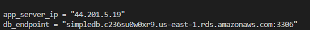

# Terraform Two-Tier Project on AWS
## Project Overview
This project provisions a simple two-tier architecture on AWS using Terraform.
It creates:
1. A VPC with public and private subnets
2. An EC2 instance for the application layer (public subnet)
3. An RDS database instance for the database layer (private subnet)
4. Security groups to control access between tiers
---
## Prerequisites
Before running this project, ensure you have:

1. Terraform
 installed (v1.x or later)
2. AWS CLI
 installed and configured (aws configure)
3. An AWS account with programmatic access (IAM user with permissions for EC2, VPC, and RDS)
---
## How to Use
### 1. Clone the Repository
```
git clone https://github.com/Williethedeveloper/fusion_links_final_project_2.git
```
### 2. Initialize Terraform
```
terraform init
```
### 3. Format your code
```
terraform fmt
```
### 4. Preview the Infrastructure
```
terraform plan
```
### 5. Apply changes
```
terraform apply
```
Type yes when prompted
### 6. Destroy resources (to avoid AWS charges)
```
terraform destroy
```

## Outputs
After applying, terraform will gove the following outputs:

1. Application server public IP
2. Database endpoint
---
An example is shown below:

=======
## Deploy two-tier architecture infrastructure on aws using terraform.
>>>>>>> 1b30786542124831b344ff40a2fae9e2b113d0a4
